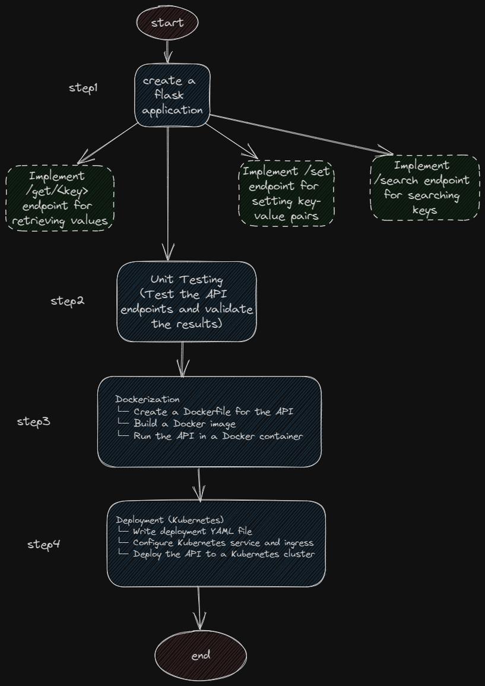

# Key-Value Store API Design Document

## Project Overview

- **Introductory Line**: The Key-Value Store API is a lightweight HTTP service that enables storing, retrieving, and searching key-value pairs efficiently.
- **Problem Statement**: The goal is to develop a scalable and user-friendly API for managing in-memory key-value data with support for prefix and suffix search functionality.
- **Intended Users**: Developers and software engineers who require a simple and reliable solution for key-value data storage and retrieval.

## Goals of the Project

- **End Goal**: Create a robust Key-Value Store API with support for storing, retrieving, and searching key-value pairs.
- **Milestones**:
  1. Implement the core functionality of storing and retrieving key-value pairs.
  2. Develop prefix and suffix search capabilities.
  3. Ensure proper test coverage for all API endpoints.
  4. Dockerize the application for easy deployment.
  5. Optionally, deploy the API on Kubernetes with zero-downtime deployments.

## Scope of the Project

- **Boundaries**: The project starts with developing the Key-Value Store API and ends with its successful deployment, either locally using Docker or on a Kubernetes cluster.
- **Functional Requirements**:
  - Store and retrieve key-value pairs via HTTP endpoints.
  - Support prefix and suffix search functionality for keys.
  - Provide proper error handling and response codes.
  - Ensure test coverage for all API endpoints.
- **Non-Functional Requirements**:
  - The API should be lightweight, scalable, and performant.
  - Maintain code modularity and readability.
  - Follow best practices for API design and documentation.

## High-Level System Design

- **Diagram**: 

## Functionalities / Workflows

- The API supports the following workflows:
  - Storing key-value pairs using the `/set` endpoint.
  - Retrieving the value of a specific key using the `/get/{key}` endpoint.
  - Searching for keys based on a prefix using the `/search?prefix={prefix}` endpoint.
  - Searching for keys based on a suffix using the `/search?suffix={suffix}` endpoint.

## TLDR

- **Conclusion**: The Key-Value Store API is a lightweight solution for efficient key-value data storage and retrieval.
- **Features Outline**: The API provides endpoints for storing, retrieving, and searching key-value pairs with support for prefix and suffix filtering.
- **Limitations and Future Improvements**: Future improvements could include adding authentication mechanisms, implementing pagination for search results, and introducing additional data persistence options.

